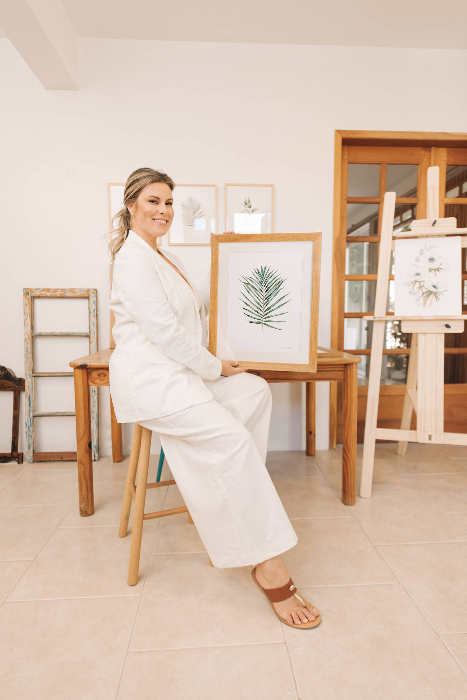

# Sobre mim

Natural de Canguçu, a arte faz parte da sua essência desde a infância, quando admirava o trabalho do pai como artesão em madeira. Carrega consigo a sensibilidade e a vontade de conectar sentimentos e natureza, através da fluidez das águas na Aquarela.
Acredita na liberdade que a arte proporciona e nas memórias afetivas que conseguimos
resgatar através da pintura.

Transformar amor em arte é o seu propósito enquanto artista, e a natureza, sua inspiração.

Aline Müller

